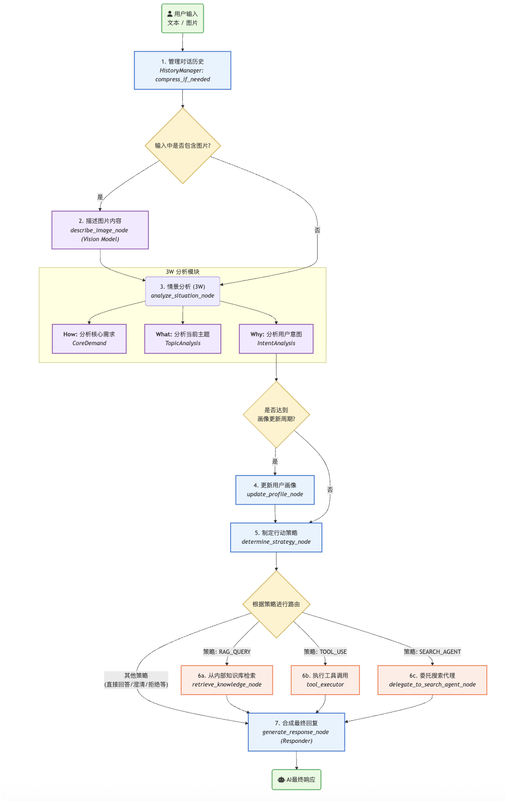

# 🤖 更懂你的AI

本教程的核心在于通过一个 **4W 情景感知框架** 来深度理解用户，从而实现更智能、更个性化的交流。为了方便代码的复制，本demo将所有的代码放在的一个文件中。

在每次回应前，AI 都会像人类一样思考：
- **WHO (用户是谁):** 基于动态用户画像，了解你的个性和偏好。
- **WHAT (在聊什么):** 分析当前对话的核心主题。
- **WHY (意图为何):** 洞察你字面下的真实意图和潜在需求。
- **HOW (需求为何):** 提炼出需要解决的具体问题或任务，选择匹配的策略。

这种“先理解，后回应”的模式，结合策略规划、工具调用和多模态能力，让 AI 不再是简单的问答机器，而是一个真正“更懂你”的智能伙伴。


## ✨ 核心特性

本项目通过一系列精心设计的模块，实现了 AI 代理的复杂思考与决策流程：

### 1. 🧠 **情景感知与深度分析**
AI 会在每次对话时对当前情景进行全面分析，构建一个“情景快照”（Situational Snapshot），这正是 4W 框架的具体实现：
- **`WHO` (用户是谁):** 动态更新和利用用户画像数据。
- **`WHAT` (聊什么):** 分析当前对话的主题，并判断是否为新话题。
- **`WHY` (意图为何):** 挖掘用户的显式意图和最多三个潜在的隐式意图。
- **`HOW` (需求为何):** 提炼用户的核心需求和关键实体，并综合选择匹配的策略。

### 2. 👤 **动态与长期的用户画像**
AI 会在对话过程中持续学习和完善你的用户画像（User Profile）。这不仅仅是简单的信息记录，而是基于**大五人格模型 (OCEAN)** 的深度推断，涵盖：
- **身份认同 (Inferred Identity):** 推断用户的基本信息。
- **个性与价值观 (Personality and Values):** 分析性格标签和价值观。
- **沟通风格 (Communication Profile):** 识别沟通特点和语言习惯。
- **知识与兴趣 (Knowledge and Interests):** 记录技能、爱好、好恶等。
- **目标与愿景 (Goals and Aspirations):** 捕捉用户提及的目标。

### 3. 🎯 **策略驱动的行动规划**
在理解了情景和用户后，AI 不会草率地直接回答，而是先制定一个明确的行动计划（Action Plan）。它会从多种策略中选择最合适的一种：
- **`直接解答 (DIRECT_ANSWER)`:** 对于简单问题，直接给出答案。
- **`澄清反问 (CLARIFY_ASK)`:** 当需求模糊时，主动提问以澄清。
- **`工具调用 (TOOL_USE)`:** 当需要执行具体任务时（如计算、查询），调用相应工具。
- **`检索增强生成 (RAG_QUERY)`:** 当需要基于内部知识库回答时，先进行检索。
- **`搜索代理 (SEARCH_AGENT_DELEGATION)`:** 当需要最新的、开放域的互联网信息时，委托给专门的搜索子代理。

### 4. 🛠️ **强大的工具与代理集成**
框架内置了灵活的工具管理器和专门的子代理，使其能力可以轻松扩展：
- **工具箱:** 预置了如网页内容抓取 (`get_url_content`)、计算器 (`calculator`) 和模拟的公司财报查询等工具。
- **搜索子代理 (Search Agent):** 一个独立的 LangGraph 工作流，专门负责处理需要互联网搜索的复杂查询，实现任务的分解和委托。

### 5. 🖼️ **多模态理解能力**
AI 不仅能理解文本，还能“看懂”图片。你可以直接上传图片、粘贴图片URL，AI 会：
- 调用多模态视觉模型（如 `qwen-vl-plus`）对一张或多张图片进行综合描述。
- 将图片内容作为对话上下文，进行相关的提问和讨论。

### 6. 🎭 **可切换的 AI 人格**
内置多种预设的 AI 人格（Persona），例如“专业AI助手”、“友好伙伴”、“创意缪斯”、“互联网段子手”等。你可以随时切换，体验不同风格的对话。

### 7. 🤔 **透明化的思考过程**
Web UI 界面右侧的“AI 在想什么”面板会实时展示 AI 的思考过程，包括**情景快照分析结果**和**行动规划详情**，让你清晰地了解 AI 每一步的决策依据。

### 8. 📚 **智能的对话历史管理**
当对话历史变得过长时，系统会自动触发压缩机制，将早期的对话内容总结为一段“前情提要”，既能保留长期记忆，又能避免超出模型的上下文长度限制。

## ⚙️ 架构概览

本框架的核心是基于 `LangGraph` 构建的状态机工作流。用户的每一次输入都会触发这个图的完整执行流程，模拟了 AI 的“思考链”。




## 🚀 安装与运行实践

请按照以下步骤在您的本地环境中部署和运行本项目。

### 1. 先决条件
- Python 3.12 或更高版本。
- 一个包管理工具，如 `pip`。

### 2. 克隆仓库
```bash
git clone https://github.com/zhao6300/3wchat.git
或者
git clone https://gitee.com/ht6300/3wchat.git

cd 3wchat
```

### 3. 安装依赖
项目依赖已在 `requirements.txt` 文件中列出。请运行以下命令进行安装：

```bash
pip install -r requirements.txt
```
以下是 `requirements.txt` 文件的内容：
```text
gradio
openai
langgraph
langchain-core
langchain-google-genai
pydantic
requests
python-dotenv
```

### 4. 环境配置
这是最关键的一步。我们强烈建议使用环境变量来配置应用。在项目根目录创建一个名为 `.env` 的文件，并将以下内容复制进去，然后根据你的需求进行修改。

#### a. `.env` 文件模板
```env
# -----------------------------------------------------------------------------
# 核心 API 配置 (必须)
# -----------------------------------------------------------------------------
# 你的 API Key 来自一个兼容 OpenAI 接口的服务 (例如: 阿里云 DashScope)
API_KEY="YOUR_API_KEY"
# 服务的 Base URL
BASE_URL="https://dashscope.aliyuncs.com/compatible-mode/v1"

# -----------------------------------------------------------------------------
# 模型选择 (可选 - 如果不设置，将使用代码中的默认值)
# 你可以为不同任务分配不同模型，以平衡成本和性能。
# 例如，使用 qwen-turbo 处理简单任务，qwen-max 处理核心任务。
# -----------------------------------------------------------------------------
ANALYSIS_MODEL="qwen-plus-latest"
STRATEGY_MODEL="qwen-plus-latest"
RESPONSE_MODEL="qwen-plus-latest"
SUMMARY_MODEL="qwen-plus-latest"
RETRIEVAL_MODEL="qwen-plus-latest"
PROFILE_MODEL="qwen-plus-latest"
VISION_MODEL="qwen-vl-plus"

# -----------------------------------------------------------------------------
# 行为定制 (可选 - 如果不设置，将使用代码中的默认值)
# -----------------------------------------------------------------------------
# 对话历史超过多少条消息后触发压缩
HISTORY_COMPRESSION_THRESHOLD=20
# 压缩时保留最近多少条消息不被压缩
MESSAGES_TO_KEEP_UNCOMPRESSED=6
# 每隔多少轮对话更新一次用户画像 (1 表示每轮都更新)
PROFILE_UPDATE_INTERVAL=1

# -----------------------------------------------------------------------------
# 工具配置 (可选)
# -----------------------------------------------------------------------------
# 用于 get_url_content 工具的 Jina Reader API Key
# 访问 https://jina.ai/reader/ 获取免费 Key
JINA_API_KEY=""
```

#### b. 配置项说明
- **API 配置 (必须)**
    - `API_KEY`: 您的服务密钥。请务必替换 `"YOUR_API_KEY"`。
    - `BASE_URL`: API 的入口地址。默认配置为阿里云 DashScope 的通义千问模型服务。

- **模型选择 (可选)**
    - 您可以为框架中不同的思考步骤（分析、策略、响应等）指定不同的模型。这对于优化成本非常有用，例如为简单任务（如摘要）使用更便宜的模型。
    - `VISION_MODEL`: 用于识别和描述图片的多模态模型。

- **行为定制 (可选)**
    - `HISTORY_COMPRESSION_THRESHOLD`: 对话历史的长度阈值。当消息总数超过此值时，会触发自动摘要功能。
    - `MESSAGES_TO_KEEP_UNCOMPRESSED`: 在执行摘要时，保留最近的 N 条消息，以确保短期上下文的完整性。
    - `PROFILE_UPDATE_INTERVAL`: 控制用户画像的更新频率。`1` 表示每轮对话都更新，`5` 表示每 5 轮对话更新一次。

### 5. 运行应用

```bash
python 3w_chat.py
```

如果一切正常，您会在终端看到类似以下的输出：
```
Running on local URL:  http://127.0.0.1:7860
```
现在，您可以在浏览器中打开 `http://127.0.0.1:7860`，开始与您的高级 AI 助手进行交互！

## 🖥️ 界面与使用指南

- **会话管理:** 在左侧边栏，您可以创建新会话 (`+ 新建会话`)、切换不同会话或删除当前选中的会话。每个会话都有独立的历史记录和用户画像。
- **切换人格:** 在左侧边栏的下拉菜单中选择一个AI人格，AI的回复风格会立即改变。
- **发送消息与图片:** 在底部的输入框中输入文本，或点击“🖼️ 上传图片”按钮来发送图片。您也可以直接在文本中粘贴图片的 URL。
- **观察思考过程:** 在右侧的“🧠 AI 在想什么”面板中，实时查看AI对您输入的分析（情景快照）和决策过程（行动规划），深入了解其工作原理。

## 🔧 扩展与定制

本框架具有良好的可扩展性，您可以轻松进行定制：

- **添加新工具:**
  1.  使用 `@tool` 装饰器定义一个新的工具函数。
  2.  在主程序入口处，使用 `tool_manager.register_tool(your_new_tool)` 进行注册。
- **添加新的人格:**
  1.  打开 `PersonaManager` 类。
  2.  在 `_load_default_personas` 方法中，仿照现有格式添加一个新的 `Persona` 实例。
- **更换或调整模型:**
  1.  直接修改 `.env` 文件中的模型名称即可。
